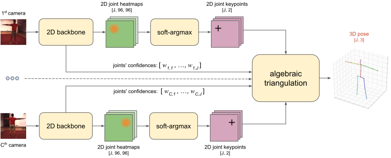
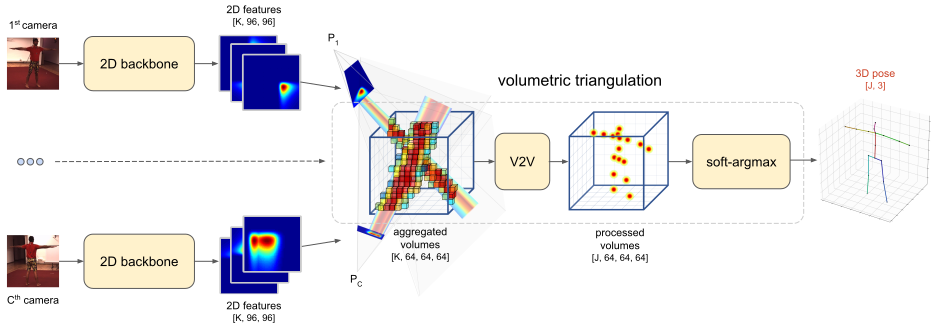

# Learnable Triangulation of Human Pose
This repository is an official PyTorch implementation of the paper ["Learnable Triangulation of Human Pose"](https://arxiv.org/abs/1905.05754) (ICCV 2019, oral). Here we tackle the problem of 3D human pose estimation from multiple cameras. We present 2 novel methods Algebraic and Volumetric learnable triangulation that **smash** previous state of the art.

If you find a bug, have a question or know to improve the code - please open an issue!

<p align="center">
  <a href="http://www.youtube.com/watch?v=z3f3aPSuhqg">
    
  </a>
</p>

# How to use
This project doesn't have any special or difficult-to-install requirements. All installation can be down with:
```bash
pip install -r requirements.txt
```

## Data
*Note:* only [Human3.6M](http://vision.imar.ro/human3.6m/description.php) dataset training/evaluation is available right now. [CMU Panoptic](http://domedb.perception.cs.cmu.edu/) dataset will be added soon.

#### Human3.6M
1. Download and preprocess the dataset by following the instruction [mvn/datasets/human36m_preprocessing/README.md](https://github.com/karfly/learnable-triangulation-pytorch/blob/master/mvn/datasets/human36m_preprocessing/README.md).
2. Place the preprocessed dataset to `data/human36m`. If you don't want to store the dataset in the directory with code, just create soft symbolic link: `ln -s {PATH_TO_HUMAN36M_DATASET}  ./data/human36m`.
3. Download pretrained backbone's weights from [here](https://drive.google.com/open?id=1TGHBfa9LsFPVS5CH6Qkcy5Jr2QsJdPEa) and place here: `data/pretrained/human36m/pose_resnet_4.5_pixels_human36m.pth`
4. *Optional*: if you want to train Volumetric model, you need rough estimations of the 3D skeleton both for train and val splits. Rough 3D skeletons can be estimated by Algebraic model and placed to `data/precalculated_results/human36m/results_train.pkl` and `data/precalculated_results/human36m/results_val.pkl` respectively. Not to bother with it, you can just use GT estimate of the 3D skeleton by setting `use_gt_pelvis: true` in a config.

#### CMU Panoptic
*Will be added soon*

## Train
Every experiment is defined by config. Some configs corresponding to experiments from the paper can be found in `experiments` directory.

#### Single-GPU

E.g. to train Volumetric model with softmax aggregation and GT-estimated pelvises using 1 GPU run:
```bash
python3 train.py --config experiments/human36m/train/human36m_vol_softmax_gtpelvis.yaml --logdir ./logs
```

The training will start with given `--config` and logs (including tensorboard files) will be stored in `--logdir`.

#### Multi-GPU
Multi-GPU training is implemented with PyTorch [DistributedDataParallel](https://pytorch.org/docs/stable/nn.html#distributeddataparallel). It can be used both for single-machine and multi-machine (cluster) training. To run the processes use PyTorch [launch utility](https://github.com/pytorch/pytorch/blob/master/torch/distributed/launch.py).

## Tensorboard
To watch your experiments you can run tensorboard:
```bash
tensorboard --logdir ./logs
```

## Evaluation
After training you can evaluate the model. Take the same config, but add path to learned weights (dumped to `logs` dir during training):
```yaml
model:
    init_weights: true
    checkpoint: {PATH_TO_WEIGHTS}
```

Also you can change other config parameters like `retain_every_n_frames_test`.

Run:
```bash
python3 train.py --eval --eval_dataset val --config experiments/human36m/eval/human36m_vol_softmax.yaml --logdir ./logs
```
Argument `--eval_dataset` can be `val` or `train`. Results can be seen in `logs` directory or in the tensorboard.

# Method overview
We present 2 novel methods Algebraic and Volumetric learnable triangulation.

## Algebraic


Our first method is based on Algebraic triangulation. It is similar to the previous approaches, but differs in 2 critical aspects:
1. It is **fully-differentiable**. To solve this we use soft-argmax aggregation and triangulate keypoints via a differentiable SVD.
2. The neural network additionally predicts **scalar confidences for each joint**, passed to triangulation module, which successfully deals with outliers and occluded joints.

For the most popular Human3.6M dataset  this method already dramatically reduces error by **2.2 times (!)**, compared to the previous art.


## Volumetric


In Volumetric triangulation model, intermediate 2D feature maps are densely unprojected to the volumetric cube and then processed with 3D-convolutional neural network. Unprojection operation allows **dense aggregation from multiple views** and the 3D-convolutional neural network is able to model **implicit human pose prior**.

Volumetric triangulation additionally improves accuracy, drastically reducing the previous state-of-the-art error by **2.4 times!** Even compared to the best parallelly developed [method](https://github.com/microsoft/multiview-human-pose-estimation-pytorch) by MSRA group, our method still offers significantly lower error - **21 mm**.

<p align="center">
  
</p>


# Cite us!
```bibtex
@article{iskakov2019learnable,
  title={Learnable Triangulation of Human Pose},
  author={Iskakov, Karim and Burkov, Egor and Lempitsky, Victor and Malkov, Yury},
  journal={arXiv preprint arXiv:1905.05754},
  year={2019}
}
```

# Contributors
 - [Karim Iskakov](https://github.com/karfly)
 - [Egor Burkov](https://github.com/shrubb)
 - [Yury Malkov](https://github.com/yurymalkov)
 - [Rasul Kerimov](https://github.com/rrkarim)
 - [Ivan Bulygin](https://github.com/blufzzz)

# News
**4 Oct 2019:** Code is released!
